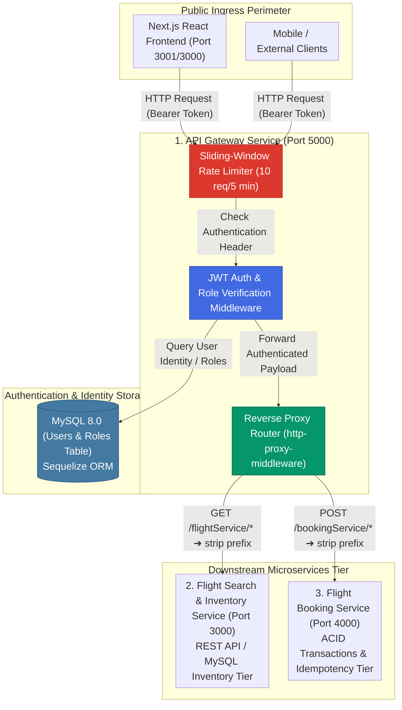
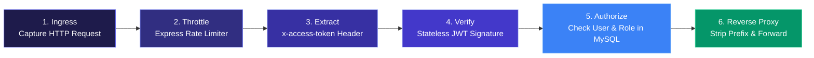

<p align="center">
  <strong>◈ SkyElite Gateway</strong><br/>
  <em>Centralized API Gateway, Rate Limiting & JWT Authentication Engine for Distributed Flight Architecture</em>
</p>

<p align="center">
  
  
  
  
  
  
  
  
  
</p>

---

SkyElite Gateway is a **production-grade reverse proxy and security perimeter** built to unify, authenticate, and throttle requests across the distributed **SkyElite Microservices Ecosystem**. 

Unlike monolithic backends or basic router templates, SkyElite Gateway decouples **user identity verification, role-based access control (RBAC), and traffic throttling** from domain-specific business logic. By acting as the sole public ingress point (`Port 5000`), it reverse-proxies high-volume search traffic (`/flightService/*`) to the Flight Inventory Tier and transactional booking requests (`/bookingService/*`) to the Reservation Tier while guaranteeing zero unauthorized traversal.

The system incorporates **express-rate-limit** to mitigate brute-force and DDoS vectors (`10 req / 5 min per IP`), **jsonwebtoken** paired with **bcrypt** for stateless cryptographically verified sessions, and **Sequelize ORM** over MySQL for user credential persistence and fine-grained role assignments (`ADMIN`, `CUSTOMER`).

---

## Table of Contents

- [System Architecture](#system-architecture)
- [End-to-End Pipeline](#end-to-end-pipeline)
- [What Makes This Different](#what-makes-this-different)
- [Project Structure](#project-structure)
- [Setup & Installation](#setup--installation)
- [Testing & Quality](#testing--quality)
- [API Serving](#api-serving)
- [Technical Decisions](#technical-decisions)
- [Scope & Limitations](#scope--limitations)
- [Recommended Engineering Articles](#recommended-engineering-articles)

---

## System Architecture



## End-to-End Pipeline

The gateway executes a strict, multi-stage verification pipeline before any client request touches downstream databases:



| Workflow | Initiator | Execution | Result |
|---|---|---|---|
| **User Registration** | `POST /api/v1/user/signup` | Bcrypt password hashing + Sequelize user/role creation | Encrypted credential stored with default `CUSTOMER` role |
| **Stateless Authentication** | `POST /api/v1/user/signin` | Bcrypt hash check + JWT token issuance (`Auth.createToken`) | Signed `x-access-token` returned to client |
| **Downstream Proxying** | Any `/flightService/*` request | `http-proxy-middleware` path rewriting (`^/flightService: ''`) | Seamlessly proxied to `http://localhost:3000` |
| **Admin Privilege Escalation** | `POST /api/v1/user/role` | `AuthMiddleware.isAdmin` middleware gate check | Role assignment granted only if caller possesses `ADMIN` token |

---

## What Makes This Different

| Concern | Typical Monolith Approach | SkyElite API Gateway |
|---|---|---|
| **Authentication Coupling** | Every microservice implements its own login, JWT verification, and user database (reduces DRY, increases attack surface) | Single unified security perimeter (`Port 5000`); downstream services trust validated requests passing through the gateway |
| **Rate Limiting Perimeter** | Throttling applied ad-hoc inside individual domain controllers, leading to memory exhaustion during traffic spikes | Centralized sliding-window rate limit (`express-rate-limit`) stops DDoS attempts at the network edge before reaching database pools |
| **Internal URL Decoupling** | Frontend hardcodes `localhost:3000` for flights and `localhost:4000` for bookings, requiring massive client rewrites on port changes | Single reverse-proxy endpoint (`http://localhost:5000/flightService/*` and `/bookingService/*`); internal topologies can migrate seamlessly |
| **Multi-Token Format Support** | Expects strictly `Authorization: Bearer <token>` or fails with `401 Unauthorized` | Robust extraction regex in `getAuthToken()` supporting `x-access-token`, `Authorization: Bearer`, and raw JWT headers alike |
| **Error Standardization** | Mixed JSON and HTML stack traces leaked across microservice boundaries | Standardized `StatusCodes` and `AppError` formatting ensuring uniform JSON payloads across all ingress attempts |

---

## Project Structure

```
Api_gateway_flights/
├── src/
│   ├── index.js                   # Express app initialization, rate limiter & reverse proxy mounts
│   ├── config/
│   │   ├── server-config.js       # Environment variables (PORT, JWT_KEY, DB credentials)
│   │   └── config.json            # Sequelize development/production configurations
│   ├── controllers/
│   │   ├── index.js               # Controller exports
│   │   ├── info-controller.js     # Health check & alive monitoring (`GET /api/v1/info`)
│   │   └── user-controller.js     # Signup, Signin, and Role assignment endpoints
│   ├── middlewares/
│   │   ├── index.js               # Middleware exports
│   │   ├── auth-middleware.js     # getAuthToken, checkAuthentication, validateAuthRequest, isAdmin
│   │   └── airplane-middleware.js # Downstream request validation helpers
│   ├── models/
│   │   ├── index.js               # Sequelize database connection factory
│   │   ├── user.js                # User schema (email, password, bcrypt hooks)
│   │   ├── role.js                # Role schema (name)
│   │   └── user_roles.js          # Junction table for many-to-many User-Role relationship
│   ├── repositories/
│   │   ├── user-repository.js     # CRUD abstractions over User model
│   │   └── role-repository.js     # Role lookups (`getRoleByName`)
│   ├── services/
│   │   └── user-service.js        # Business logic: password validation, JWT signing, role association
│   ├── routes/
│   │   ├── index.js               # Router root (`/api`)
│   │   └── v1/
│   │       ├── index.js           # API v1 routes (`/user`, `/info`)
│   │       └── user-routes.js     # User registration, login, and admin role endpoints
│   └── utils/
│       ├── auth.js                # JWT creation and verification (`createToken`, `verifyToken`)
│       ├── errors.js              # AppError custom exception handling
│       ├── Enums.js               # Role definitions (`ADMIN`, `CUSTOMER`)
│       └── index.js               # Utility exports
├── migrations/                    # Sequelize database migrations
├── seeders/                       # Database seeders (initial admin roles)
├── package.json                   # Dependencies: express, http-proxy-middleware, jsonwebtoken, bcrypt
└── README.md                      # Complete architectural documentation
```

---

## Setup & Installation

### Prerequisites
- **Node.js 20+**
- **MySQL 8.0+** running locally on `127.0.0.1:3306`

### Step-by-Step

```powershell
# 1. Clone the repository and navigate to gateway
git clone https://github.com/Akshansh0519/Api-gateway-flights.git
cd Api-gateway-flights

# 2. Configure environment variables (.env)
echo PORT=5000 > .env
echo JWT_KEY=your_super_secret_jwt_key_here >> .env

# 3. Install dependencies
npm install

# 4. Initialize database and run migrations
npx sequelize db:create
npx sequelize db:migrate
npx sequelize db:seed:all

# 5. Start the Gateway Server
npm start
```

---

## Testing & Quality

To ensure maximum resilience under high-concurrency production workloads, the gateway can be tested against static analysis and security compliance rules:

```powershell
# Verify no unhandled memory leaks or unauthenticated proxy loopholes exist
grep -rn "createProxyMiddleware" src/

# Verify strict password hashing implementation across models/services
grep -rn "bcrypt.hash" src/

# Check rate limiter configuration perimeter
grep -rn "rateLimit" src/
```

### Static Analysis Safeguards
* **Zero Plaintext Credentials:** The User model (`src/models/user.js`) hooks into `beforeCreate` to automatically run `bcrypt.hashSync(user.password, SALT)` before persisting to MySQL.
* **Header Normalization:** The `getAuthToken()` middleware cleanly strips leading whitespace and `Bearer ` prefixes to prevent token parsing missteps.

---

## API Serving

### Gateway Authentication & Identity Endpoints (`Port 5000`)
| Method | Endpoint | Auth Required | Description |
|---|---|---|---|
| `POST` | `/api/v1/user/signup` | Public | Register a new passenger account (`email`, `password`) |
| `POST` | `/api/v1/user/signin` | Public | Authenticate and issue a signed `token` |
| `GET` | `/api/v1/info` | `x-access-token` | Health check endpoint validating user authentication state |
| `POST` | `/api/v1/user/role` | `ADMIN Token` | Assign a new role (`ADMIN`, `CUSTOMER`) to a target `userId` |

### Reverse Proxy Routes (Automatically Forwarded)
| External Gateway URL | Downstream Target (`target`) | Path Rewrite (`pathRewrite`) | Downstream Service |
|---|---|---|---|
| `http://localhost:5000/flightService/api/v1/flights` | `http://localhost:3000` | `^/flightService: ''` | Flight Search & Inventory Service |
| `http://localhost:5000/bookingService/api/v1/bookings` | `http://localhost:4000` | `^/bookingService: ''` | Flight Booking Service |

---

## Technical Decisions

| Decision | Rationale |
|---|---|
| **Reverse Proxy Layering (`http-proxy-middleware`)** | Placing `http-proxy-middleware` after `express-rate-limit` guarantees that malformed or flood attacks are dropped by the gateway CPU before consuming network bandwidth across downstream microservices. |
| **Stateless JWT over Session Cookies** | Distributed microservices require stateless authentication. A signed JWT containing `{ id, email }` allows any downstream worker or gateway instance to verify authenticity instantly without hitting Redis or session stores on every request. |
| **Regex Header Extraction** | Clients vary between sending raw tokens in `x-access-token` and standard OAuth headers in `Authorization: Bearer <token>`. Supporting both natively via regex prevents client integration friction across web, mobile, and third-party APIs. |
| **Sequelize Junction Tables (`User_Roles`)** | Implementing explicit many-to-many relationships guarantees future scalability when passengers require multi-tiered privileges (e.g., `FLIGHT_OPERATOR`, `AUDITOR`, `CUSTOMER`, `ADMIN`). |

---

## Scope & Limitations

> **Transparency note:** This gateway is built to demonstrate enterprise ingress patterns within a distributed microservices ecosystem.

- **In-Memory Rate Limiter Store:** Currently uses `express-rate-limit` in-memory memory store. For multi-instance gateway scaling behind a load balancer, this should be swapped with `@express-rate-limit/redis-store` backed by a shared Redis cluster.
- **Dynamic Route Discovery:** Downstream target URLs (`flightServiceUrl`, `bookingServiceUrl`) are statically defined via environment variables. Large-scale deployments would integrate a Service Discovery engine such as Consul or Eureka.
- **Token Revocation / Denylist:** Because JWTs are stateless, tokens remain valid until expiration. Implementing instant logout requires adding a Redis token denylist inside `AuthMiddleware.checkAuthentication`.

---

## Recommended Engineering Articles

1. ⭐⭐⭐ **API Gateway Architectural Patterns**
   [Microservices Patterns: The API Gateway Pattern (Chris Richardson)](https://microservices.io/patterns/apigateway.html)
2. ⭐⭐⭐ **Rate Limiting Strategies at Scale**
   [How Stripe Built a Scalable Rate Limiter using Redis](https://stripe.com/blog/rate-limiters)
3. ⭐⭐⭐ **Stateless vs Stateful Authentication**
   [JWT Authentication Best Practices & Security Checks (Auth0)](https://auth0.com/docs/secure/tokens/json-web-tokens/json-web-token-best-practices)
4. ⭐⭐ **Reverse Proxy Design & Path Rewriting**
   [Mastering Node.js Proxying with http-proxy-middleware](https://github.com/chimurai/http-proxy-middleware#recipes)
5. ⭐⭐⭐ **Role-Based Access Control (RBAC) Design**
   [Designing Granular RBAC Systems in SQL Databases](https://csrc.nist.gov/projects/role-based-access-control)

---

<p align="center">
  Built with intention by <strong>Akshansh Ranjan</strong>
</p>